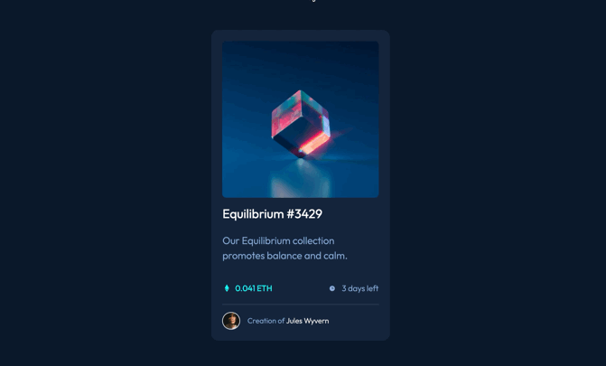

# Frontend Mentor - NFT preview card component solution

This is my solution to the [NFT preview card component challenge on Frontend Mentor](https://www.frontendmentor.io/challenges/nft-preview-card-component-SbdUL_w0U). Frontend Mentor challenges help you improve your coding skills by building realistic projects.

### Screenshot

## Table of contents

- [Overview](#overview)
  - [The challenge](#the-challenge)
  - [Links](#links)
- [My process](#my-process)
  - [Built with](#built-with)
  - [What I learned](#what-i-learned)
  - [Continued development](#continued-development)
  - [Useful resources](#useful-resources)
- [Author](#author)
- [Acknowledgments](#acknowledgments)

## Overview

### The challenge

Users should be able to:

- View the optimal layout depending on their device's screen size
- See hover states for interactive elements

### Links

- Solution URL: [My Solution](https://github.com/sevrinn/nft-preview-card)
- Live Site URL: [My deployed site](https://sevrinn.github.io/nft-preview-card/)

## My process

I want to start this off by saying this was merely an exercise in coding from a design file and that I do not approve of NFTS or crypto anything related to that nonsense. IDC. Its not good for the planet. End of story.

Moving on...

My process started off again with the HTML skeleton. This is another classic top/bottom card situation. 
- .container div
  - .top div
    - img wrapped in an a link tag (<a>)
    - .overlay div
      - icon-bg
        - icon
  - .bottom div
    - h1 wrapped in a link tag
    - p
    - .info div
      - .info-item div
        - img
        - p 
      - .info-item div
        - img
        - p 
    - .avatar div
      - img 
      - p

I set up my SASS files (which i felt pretty confident setting up) and started adding layout css, followed by the styles.

I used a technique where you set up an hidden overlay that appears when user hovers over it with their cursor for the main image. I had a little trouble with it and its still not perfect but I think it looks pretty good.

I also implemented some smoother animation transitions to the hover effects of all the links. 

I put this on on github pages as well. fun quick exercise!

### Built with

- Semantic HTML5 markup
- CSS custom properties
- Flexbox
- Mobile-first workflow
- [SASS](https://sass-lang.com/) - Sass

## Author

- Website - [Sevrinn Welker](https://sevrinn.dev/)
- Frontend Mentor - [@sevrinn](https://www.frontendmentor.io/profile/sevrinn)
- Twitter - [@sev_welker](https://www.twitter.com/sev_welker)

